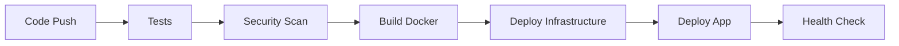

# Cloud-Computing-Project

🏥 **Application ML de Prédiction du Cancer du Sein**

Application cloud complète qui prédit si un patient est atteint du cancer du sein via un modèle de machine learning, avec API FastAPI, stockage Azure Blob, Docker, Terraform et CI/CD automatisé.

## 🚀 Architecture

- **Machine Learning**: Modèle RandomForest avec scikit-learn sur le dataset breast cancer
- **API**: FastAPI avec endpoints RESTful
- **Stockage**: Azure Blob Storage pour les données et modèles
- **Containerisation**: Docker avec multi-stage builds
- **Infrastructure**: Terraform pour déployer sur Azure
- **CI/CD**: GitHub Actions pour déploiement automatique
- **Cloud**: Microsoft Azure (App Service, Container Registry, Blob Storage)

## 📁 Structure du Projet

```
├── src/                          # Code source
│   ├── api/                      # API FastAPI
│   │   ├── main.py              # Application principale
│   │   └── schemas.py           # Modèles Pydantic
│   ├── models/                   # Modèles ML
│   │   └── breast_cancer_model.py
│   └── utils/                    # Utilitaires
│       └── azure_storage.py     # Gestion Azure Blob
├── terraform/                    # Infrastructure as Code
│   ├── main.tf                  # Configuration principale
│   ├── variables.tf             # Variables
│   ├── resources.tf             # Ressources Azure
│   └── outputs.tf               # Sorties
├── .github/workflows/            # CI/CD
│   ├── ci-cd.yml               # Pipeline principal
│   └── infrastructure.yml       # Déploiement infra
├── tests/                        # Tests unitaires
├── Dockerfile                    # Image Docker
├── docker-compose.yml           # Orchestration locale
└── requirements.txt             # Dépendances Python
```

## 🛠️ Installation et Développement Local

### Prérequis

- Python 3.9+
- Docker
- Azure CLI
- Terraform

### 1. Cloner et installer

```powershell
git clone <repo-url>
cd Cloud-Computing-Project
pip install -r requirements.txt
```

### 2. Configuration

```powershell
# Copier le fichier d'exemple
cp .env.example .env

# Éditer .env avec vos credentials Azure
# AZURE_STORAGE_CONNECTION_STRING="DefaultEndpointsProtocol=https;AccountName=..."
```

### 3. Entraîner le modèle

```powershell
# Entraîner et sauvegarder le modèle
python train_model.py
```

### 4. Lancer l'API localement

```powershell
# Option 1: Direct Python
uvicorn src.api.main:app --host 0.0.0.0 --port 8000 --reload

# Option 2: Docker
.\run_docker.ps1

# Option 3: Docker Compose
docker-compose up
```

### 5. Tester l'API

```powershell
# Test automatique
python test_api.py

# Test manuel
curl http://localhost:8000/health
```

## ☁️ Déploiement Azure

### 1. Configuration des secrets GitHub

Ajoutez ces secrets dans votre repository GitHub :

```
AZURE_CREDENTIALS='{
  "clientId": "...",
  "clientSecret": "...",
  "subscriptionId": "...",
  "tenantId": "..."
}'
REGISTRY_NAME="votre-acr-name"
RESOURCE_GROUP="votre-rg-name"
APP_NAME="votre-app-name"
ACR_USERNAME="username"
ACR_PASSWORD="password"
```

### 2. Déploiement Infrastructure

```powershell
# Via GitHub Actions (recommandé)
# Push sur main déclenche automatiquement le déploiement

# Ou manuellement avec Terraform
cd terraform
terraform init
terraform plan
terraform apply
```

### 3. Déploiement Application

Le déploiement se fait automatiquement via GitHub Actions lors d'un push sur `main`:

1. **Tests** - Exécution des tests unitaires
2. **Security** - Scan de sécurité (Bandit, Safety)
3. **Build** - Construction de l'image Docker
4. **Deploy Infrastructure** - Déploiement Terraform
5. **Deploy App** - Déploiement sur Azure App Service
6. **Health Check** - Vérification du bon fonctionnement

## 📊 API Endpoints

### Endpoints principaux

- `GET /health` - Health check
- `GET /model/info` - Informations sur le modèle
- `POST /predict` - Prédiction cancer du sein
- `POST /model/retrain` - Réentraîner le modèle

### Exemple d'utilisation

```python
import requests

# Prédiction
features = [17.99, 10.38, 122.8, 1001.0, 0.1184, ...]  # 30 features
response = requests.post(
    "https://votre-app.azurewebsites.net/predict",
    json={"features": features}
)

result = response.json()
# {
#   "prediction": 1,
#   "prediction_label": "benign",
#   "confidence": 0.85,
#   "probabilities": {"malignant": 0.15, "benign": 0.85}
# }
```

## 🧪 Tests

```powershell
# Tous les tests
pytest

# Tests avec coverage
pytest --cov=src --cov-report=html

# Tests spécifiques
pytest tests/test_api.py -v
```

## 🔒 Sécurité

- Authentification Azure avec Managed Identity
- Secrets stockés dans Azure Key Vault
- Scan de sécurité automatique (Bandit, Safety)
- Images Docker sans privilèges root
- HTTPS obligatoire

## 📈 Monitoring

- Application Insights pour les logs et métriques
- Health checks automatiques
- Monitoring des performances de l'API

## 🚀 Workflow CI/CD



## 🤝 Contribution

1. Fork le repository
2. Créer une branche feature (`git checkout -b feature/AmazingFeature`)
3. Commit les changements (`git commit -m 'Add AmazingFeature'`)
4. Push la branche (`git push origin feature/AmazingFeature`)
5. Ouvrir une Pull Request

## 📝 Licence

Ce projet est sous licence MIT. Voir le fichier `LICENSE` pour plus de détails.

## 🔗 Liens Utiles

- [Documentation FastAPI](https://fastapi.tiangolo.com/)
- [Azure App Service](https://docs.microsoft.com/en-us/azure/app-service/)
- [Terraform Azure Provider](https://registry.terraform.io/providers/hashicorp/azurerm/latest)
- [GitHub Actions](https://docs.github.com/en/actions)
